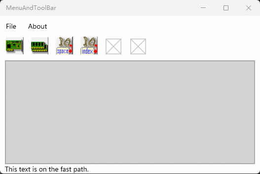

# UWP绘制一个表格  
图形界面：xaml  
开发语言：C#  
开发平台：Win11 22H2  
开发工具：Visual Studio 2022  
实现功能：写一个菜单栏和一个工具栏  

## 写一个菜单栏  
~~~xml
<!--菜单栏-->
        <Grid.RowDefinitions>
            <RowDefinition Height="Auto"></RowDefinition>
            <RowDefinition Height="50"></RowDefinition>
            <RowDefinition Height="*"></RowDefinition>
            <RowDefinition Height="Auto"></RowDefinition>
        </Grid.RowDefinitions>
        <MenuBar Grid.Row="0">
            <MenuBarItem Title="File">
                <MenuFlyoutItem Text="New" Click="New_Clicked"/>
                <MenuFlyoutItem Text="Open"/>
                <MenuFlyoutItem Text="Save"/>
                <MenuFlyoutItem Text="Add"/>
                <MenuFlyoutItem Text="Delete"/>
                <MenuFlyoutItem Text="Close"/>
            </MenuBarItem>

            <MenuBarItem Title="About">
                <MenuFlyoutItem Text="About"/>
            </MenuBarItem>
        </MenuBar>
~~~   

## 写一个工具栏  
~~~xml
<!--工具栏-->
        <Grid Grid.Row="1" Margin="10,0,10,10" Padding="0">
            <Grid.ColumnDefinitions>
                <ColumnDefinition Width="50"></ColumnDefinition>
                <ColumnDefinition Width="50"></ColumnDefinition>
                <ColumnDefinition Width="50"></ColumnDefinition>
                <ColumnDefinition Width="50"></ColumnDefinition>
                <ColumnDefinition Width="50"></ColumnDefinition>
                <ColumnDefinition Width="50"></ColumnDefinition>
                <ColumnDefinition Width="*"></ColumnDefinition>
            </Grid.ColumnDefinitions>
            <Button x:Name="New_Button" Grid.Column="0" Click="New_Clicked" Padding="0" Height="40" Width="40" Background="{x:Null}" ToolTipService.ToolTip="New File" ToolTipService.Placement="Bottom">
                <StackPanel>
                    <Image Source="/Assets/PCI_Device.png" Height="40" Stretch="Fill"/>
                </StackPanel>
            </Button>
            <Button x:Name="Open_Button" Grid.Column="1" Padding="0" Height="40" Width="40" Background="{x:Null}" ToolTipService.ToolTip="Open File" ToolTipService.Placement="Bottom">
                <StackPanel>
                    <Image Source="/Assets/Memory_Dump.png" Height="40" Stretch="Fill"/>
                </StackPanel>
            </Button>
            <Button x:Name="Save_Button" Grid.Column="2" Padding="0" Height="40" Width="40" Background="{x:Null}" ToolTipService.ToolTip="Save File" ToolTipService.Placement="Bottom">
                <StackPanel>
                    <Image Source="/Assets/IO_Space.png" Height="40" Stretch="Fill"/>
                </StackPanel>
            </Button>
            <Button x:Name="Add_Button" Grid.Column="3" Padding="0" Height="40" Width="40" Background="{x:Null}" ToolTipService.ToolTip="Add File" ToolTipService.Placement="Bottom">
                <StackPanel>
                    <Image Source="/Assets/IO_Index_Data.png" Height="40" Stretch="Fill"/>
                </StackPanel>
            </Button>
            <Button x:Name="Delete_Button" Grid.Column="4" Padding="0" Height="40" Width="40" Background="{x:Null}" ToolTipService.ToolTip="Delete File" ToolTipService.Placement="Bottom">
                <StackPanel>
                    <Image Source="/Assets/LockScreenLogo.scale-200.png" Height="40"/>
                </StackPanel>
            </Button>
            <Button x:Name="Close_Button" Grid.Column="5" Padding="0" Height="40" Width="40" Background="{x:Null}" ToolTipService.ToolTip="Close File" ToolTipService.Placement="Bottom">
                <StackPanel>
                    <Image Source="/Assets/LockScreenLogo.scale-200.png" Height="40"/>
                </StackPanel>
            </Button>
        </Grid>
~~~

## Button属性  
1. Ellipse 椭圆  
2. ToolTipService.ToolTip="New File"：悬浮文字   
3. ToolTipService.Placement="Bottom"：悬浮文字位置  
4. Background="{x:Null}"：背景  
5. Click="New_Clicked"：单击事件  

## 效果演示  
  

