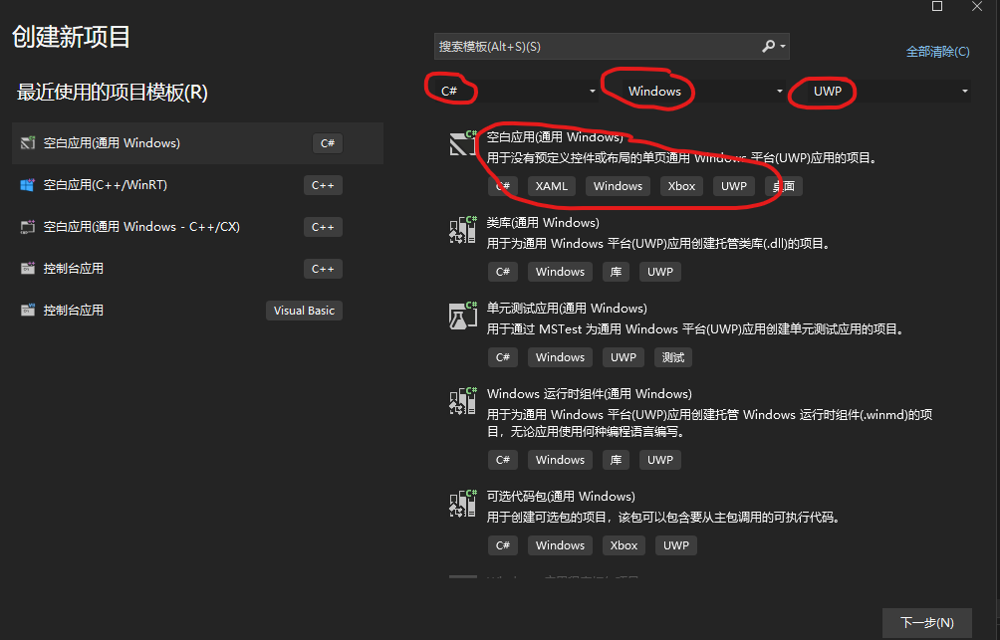
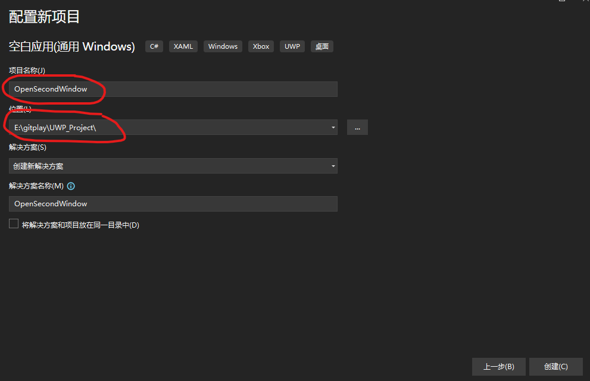
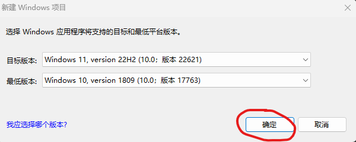
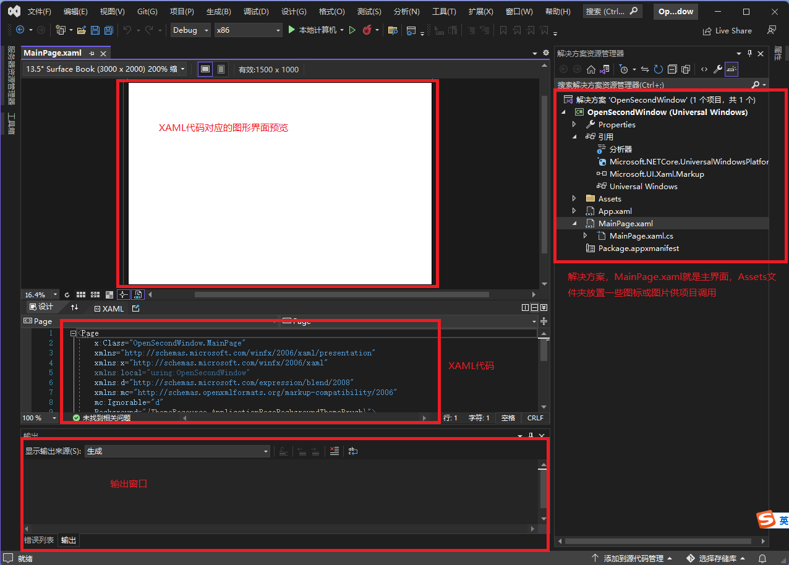
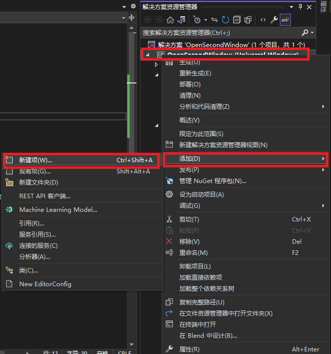
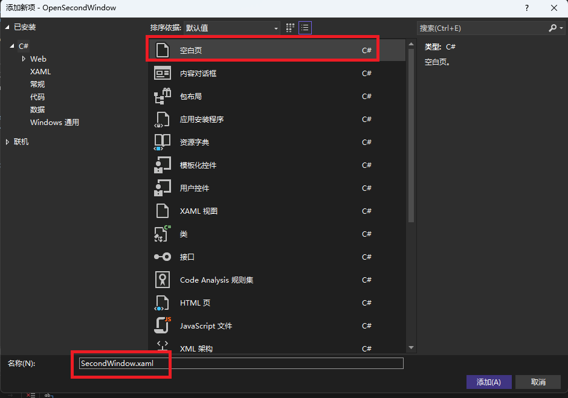
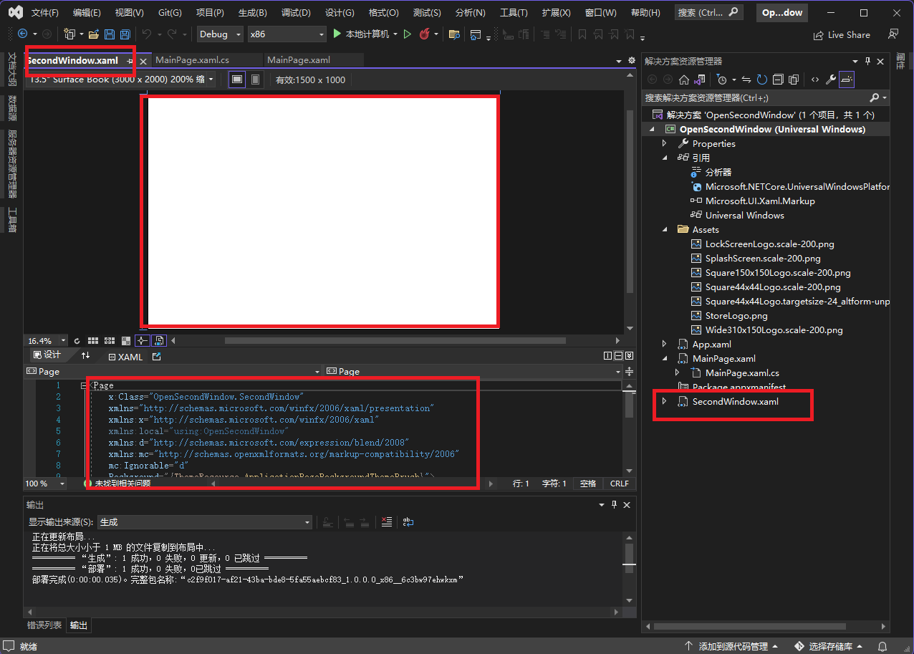
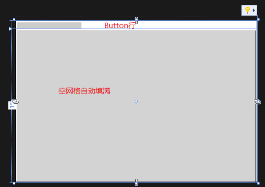
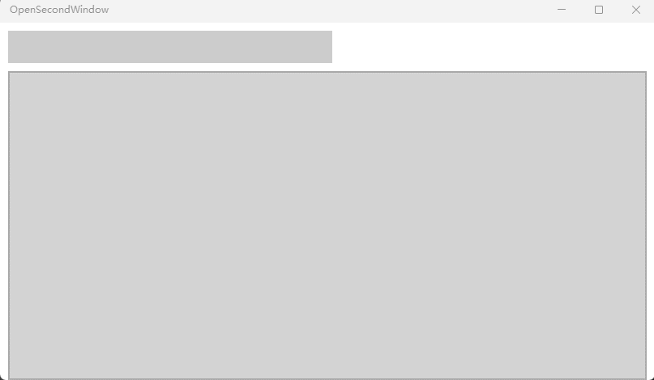

# UWP新建一个窗口  
图形界面：xaml  
开发语言：C#  
开发平台：Win11 22H2  
开发工具：Visual Studio 2022  
实现功能：页面分为2部分，上半部分放置Button，下半部分区域空置，当点击Button时，会在下半部分区域弹出一个新窗口

## 创建一个UWP项目
第一步：【文件】-》【新建】-》【项目】，选择C#，Windows，UWP，空白应用（通用Windows）。   
  
第二步：填写项目名称，随便取名，选择项目路径，随便选个文件夹。
  
第三步：SDK平台默认就是当前电脑的最新版，确定就好。  
  
第四步：项目新建成功界面  
  

## 创建第二个窗口的页面  
第一步：右击项目-》【添加】-》【新建项】。  
  
第二步：将空白页的名称取名为SecondWindow。  
  
第三步：可以看到项目目录多了SecondWindow这个页面。  
  
其实和MainPage的操作方式都相同，接下来看的就是怎么将主窗口和这个窗口联系在一起了。  

## MainPage XAML界面   
第一步：首先布局，将页面分为上下两个部分    
~~~xml
<Grid.RowDefinitions>
    <RowDefinition Height="Auto"></RowDefinition>
    <RowDefinition Height="*"></RowDefinition>
</Grid.RowDefinitions>
~~~
这段代码是以网格的形式设置页面，将页面分为2行，第一行高度取决于控件的高度，第二行高度自动填满。  
第二步：在第一行放置一个打开新页面的Button，第二行是一个空网格  
~~~xml
<Grid Grid.Row="0" Margin="10,0,10,0" Padding="0">
    <Button x:Name="Open_Second_Window" Grid.Column="0" Click="Button_Clicked" Margin="0,10,0,0" Padding="0" Height="40" Width="400"></Button>
</Grid>
<Grid Grid.Row="1" Name="FrameContainer" x:FieldModifier="public" Background="LightGray" Margin="10,10,10,0" Padding="0" BorderBrush="#55020403" BorderThickness="2"></Grid>
~~~
预览的图形界面是：  
  
第三步：在C#代码中实现Button_Clicked函数，转到C#端  
MainPage.xaml完整代码：  
~~~xml
<Page
    x:Class="OpenSecondWindow.MainPage"
    xmlns="http://schemas.microsoft.com/winfx/2006/xaml/presentation"
    xmlns:x="http://schemas.microsoft.com/winfx/2006/xaml"
    xmlns:local="using:OpenSecondWindow"
    xmlns:d="http://schemas.microsoft.com/expression/blend/2008"
    xmlns:mc="http://schemas.openxmlformats.org/markup-compatibility/2006"
    mc:Ignorable="d"
    Background="{ThemeResource ApplicationPageBackgroundThemeBrush}">

    <Grid>
        <Grid.RowDefinitions>
            <RowDefinition Height="Auto"></RowDefinition>
            <RowDefinition Height="*"></RowDefinition>
        </Grid.RowDefinitions>

        <Grid Grid.Row="0" Margin="10,0,10,0" Padding="0">
            <Button x:Name="Open_Second_Window" Grid.Column="0" Click="Button_Clicked" Margin="0,10,0,0" Padding="0" Height="40" Width="400">
            </Button>
        </Grid>

        <Grid Grid.Row="1" Name="FrameContainer" x:FieldModifier="public" Background="LightGray" Margin="10,10,10,0" Padding="0" BorderBrush="#55020403" BorderThickness="2">
        </Grid>

    </Grid>
</Page>

~~~

## MainPage.xaml.cs代码逻辑
在XAML代码中用鼠标选中Button_Clicked，右击转到定义或者F12就可以转到C#代码页中。  
第一步：打开新窗口的方法  
~~~C#
private async void Button_Clicked(object sender, RoutedEventArgs e)
{
    AppWindow appWindow = await AppWindow.TryCreateAsync(); // 新建一个appWindow，窗口
    Frame secondWindow = new Frame();  // 新建一个页面
    secondWindow.Navigate(typeof(SecondWindow));  // 将页面导航到第二个窗口SecondWindow.xaml
    ElementCompositionPreview.SetAppWindowContent(appWindow, secondWindow); // 将新建的窗口和页面绑定起来
    appWindow.RequestSize(new Size(220, 110));  // 设置窗口大小
    appWindow.Title = "Page2"; // 设置新窗口标题
    Point offset = new Point(20, 110);  // 设置坐标，此坐标是相对于主窗口的坐标
    appWindow.RequestMoveRelativeToCurrentViewContent(offset);  // 将第二个窗口定位到坐标位置
    await appWindow.TryShowAsync();  // 将窗口show出来
}
~~~

## 效果图展示  
  

