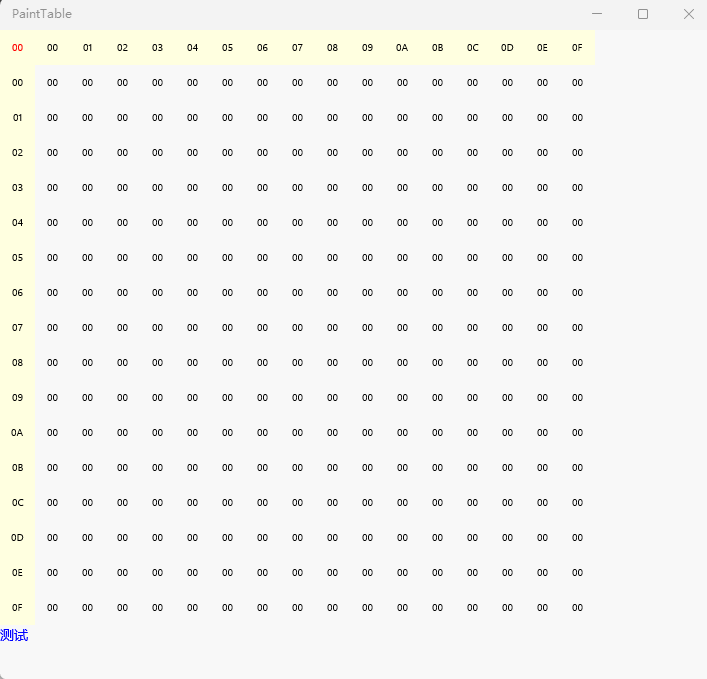

# UWP绘制一个表格  
图形界面：xaml  
开发语言：C#  
开发平台：Win11 22H2  
开发工具：Visual Studio 2022  
实现功能：页面部分分为18行，第18行就是一个测试的TextBlock，用来看看网格点击的位置。前面17行用来动态画出网格。从上到下依次画出17个button后换列，直到画了17列，其中button Name的编号依次加1。双击网格中的Button，测试TextBlock会打印button的编号。  

## 用代码绘制一个表格  
用代码循环绘制一个17*17的网格  
CS代码
~~~C#
private void initial_grid() {
            for (int i = 0; i < 17; i++)
            {
                for (int j = 0; j < 17; j++)
                {
                    Button b = new Button();
                    b.Height = 35;
                    b.Width = 35;
                    b.VerticalAlignment = VerticalAlignment.Top;
                    b.HorizontalAlignment = HorizontalAlignment.Left;
                    b.Margin = new Thickness(0, 0, 0, 0);
                    b.FontSize = 10;
                    b.Name = (i*17+j).ToString(); 
                    if (i == 0 && j == 0)
                    {
                        b.Content = "00";
                        Windows.UI.Xaml.Media.SolidColorBrush mycolor = new SolidColorBrush(Windows.UI.Colors.LightYellow);
                        b.Background = mycolor;
                        Windows.UI.Xaml.Media.SolidColorBrush mycolor1 = new SolidColorBrush(Windows.UI.Colors.Red);
                        b.Foreground = mycolor1;
                        
                    }
                    else if (i == 0 && j != 0)
                    {
                        b.Content = (j - 1).ToString("X2");
                        //b.IsEnabled = false;
                        Windows.UI.Xaml.Media.SolidColorBrush mycolor = new SolidColorBrush(Windows.UI.Colors.LightYellow);
                        b.Background = mycolor;
                        

                    }
                    else if (i != 0 && j == 0)
                    {
                        b.Content = (i - 1).ToString("X2");
                        //b.IsEnabled = false;
                        Windows.UI.Xaml.Media.SolidColorBrush mycolor = new SolidColorBrush(Windows.UI.Colors.LightYellow);
                        b.Background = mycolor;
                        
                    }
                    else
                    {
                        b.Content = "00";
                        Windows.UI.Xaml.Media.SolidColorBrush mycolor = new SolidColorBrush(Windows.UI.Colors.White);
                        b.Background = mycolor;
                    }

                    b.Click += Button_Click;
                    b.DoubleTapped += B_DoubleTapped;

                    int column = (int)(buttonCounter / 17);
                    int row = buttonCounter % 17;

                    // Check if you need to add a columns
                    if (row == 0)
                    {
                        ColumnDefinition col = new ColumnDefinition();
                        col.Width = new GridLength(column, GridUnitType.Auto);
                        myGrid.ColumnDefinitions.Add(col);
                    }
                    //Add the button
                    myGrid.Children.Add(b);
                    Grid.SetColumn(b, column);
                    Grid.SetRow(b, row);
                    buttonCounter++;
                }
            }
        }
~~~

## 效果演示  
  
