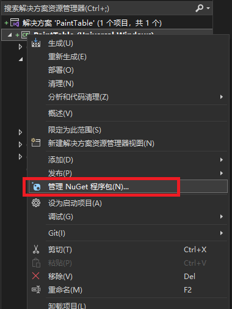
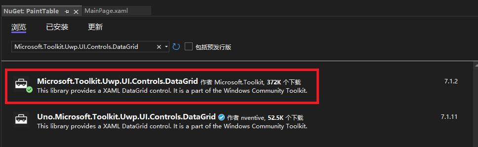
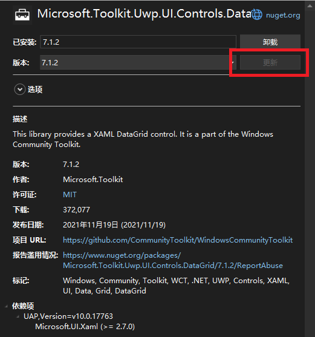

# UWP绘制一个表格  
参考链接：https://www.likecs.com/show-308504507.html  
http://www.manongjc.com/detail/52-xolstugucnisbky.html  
https://learn.microsoft.com/zh-CN/uwp/api/windows.ui.xaml.controls.gridview?view=winrt-22621  

## 安装Microsoft.Toolkit.Uwp.UI.Controls.DataGrid库  
第一步：右击项目--》【管理NulGet程序包】--》搜索【Microsoft.Toolkit.Uwp.UI.Controls.DataGrid】--》【浏览】--》【安装】  
  
  
  

## 使用GridView画表格  
解决了单元格大小不能很紧凑的在一起。但是无法显示框线，也不知道如何调用双击事件。Game Over  
XAML
~~~xml
<GridView ItemsSource="{Binding Source={StaticResource cvsProjects}}" IsItemClickEnabled="True" ItemClick="ItemClick" SelectionMode="None">
            <GridView.ItemContainerStyle>
                
            </GridView.ItemContainerStyle>
            <GridView.ItemTemplate>
                <DataTemplate>
                    <StackPanel BorderBrush="Black" Orientation="Vertical" Height="30" Width="30">
                        <TextBlock Text="{Binding Name}" 
                               FontSize="12"/>
                    </StackPanel>
                    <!--<Border Height="30" Width="30">
                        <TextBlock Text="{Binding Name}" 
                               FontSize="12"/>
                    </Border>-->
                    <!--<TextBlock Text="{Binding Name}" FontWeight="Bold" FontSize="8"/>-->
                    <!--<StackPanel>
                        <TextBlock MaxWidth="30" MaxHeight="30" HorizontalAlignment="Center" Text="{Binding Name}"/>
                    </StackPanel>-->
                </DataTemplate>
            </GridView.ItemTemplate>

            <GridView.ItemsPanel>
                <ItemsPanelTemplate>
                    <!--<ItemsWrapGrid MaximumRowsOrColumns="16" ItemWidth="25" ItemHeight="25" />-->
                    <!--<WrapGrid MaximumRowsOrColumns="16" ItemWidth="30" ItemHeight="30" Orientation="Horizontal" VerticalChildrenAlignment="Center" />-->
                    <WrapGrid MaximumRowsOrColumns="16" ItemWidth="30" ItemHeight="30" />
                </ItemsPanelTemplate>
            </GridView.ItemsPanel>

        </GridView>
~~~

CS
~~~C#
public sealed partial class MainPage : Page
    {
        //DateTime startDate = DateTime.Now;
        public MainPage()
        {
            this.InitializeComponent();
            ApplicationView.PreferredLaunchViewSize = new Size(800, 800);
            ApplicationView.PreferredLaunchWindowingMode = ApplicationViewWindowingMode.PreferredLaunchViewSize;
            PopulateProjects();

        }

        private void PopulateProjects()
        {
            List<Project> Projects = new List<Project>();

            //// 第一列
            Project newProject = new Project();

            for (int i = 0; i < 16; i++)
            {
                newProject = new Project();
                //newProject.Name = "01";
                for (int j = 0; j < 16; j++)
                {
                    newProject.Activities.Add(new Activity()
                    { Name = "00" });
                }
                Projects.Add(newProject);
            }

            cvsProjects.Source = Projects;
        }

    }

    public class Project
    {
        public Project()
        {
            Activities = new ObservableCollection<Activity>();
        }

        public string Name { get; set; }
        public ObservableCollection<Activity> Activities { get; private set; }
    }

    public class Activity
    {
        public string Name { get; set; }
    }
~~~

## 使用DataGrid画表格  
用DataGrid画表格，问题行标题颜色，列标题颜色不知道怎么搞，双击事件不知道怎么触发。  
xaml
~~~xml
<Page
    x:Class="PaintTable.MainPage"
    xmlns="http://schemas.microsoft.com/winfx/2006/xaml/presentation"
    xmlns:x="http://schemas.microsoft.com/winfx/2006/xaml"
    xmlns:local="using:PaintTable"
    xmlns:d="http://schemas.microsoft.com/expression/blend/2008"
    xmlns:mc="http://schemas.openxmlformats.org/markup-compatibility/2006"
    xmlns:controls="using:Microsoft.Toolkit.Uwp.UI.Controls"
    mc:Ignorable="d"
    Background="{ThemeResource ApplicationPageBackgroundThemeBrush}">

    <Grid>
        <Grid.ColumnDefinitions>
            <ColumnDefinition Width="auto"></ColumnDefinition>
            <ColumnDefinition Width="auto"></ColumnDefinition>
            <ColumnDefinition Width="*"></ColumnDefinition>
        </Grid.ColumnDefinitions>
        <StackPanel Grid.Column="1">
            <controls:DataGrid x:Name="dataGrid" AutoGenerateColumns="False" FontStretch="Normal" FontSize="8" HeadersVisibility="Row">
                <controls:DataGrid.Columns>
                    <controls:DataGridTextColumn Header="00" Binding="{Binding zero}"/>
                    <controls:DataGridTextColumn Header="01" Binding="{Binding one}"/>
                    <controls:DataGridTextColumn Header="02" Binding="{Binding two}"/>
                    <controls:DataGridTextColumn Header="03" Binding="{Binding three}"/>
                    <controls:DataGridTextColumn Header="04" Binding="{Binding four}"/>
                    <controls:DataGridTextColumn Header="05" Binding="{Binding five}"/>
                    <controls:DataGridTextColumn Header="06" Binding="{Binding six}"/>
                    <controls:DataGridTextColumn Header="07" Binding="{Binding seven}"/>
                    <controls:DataGridTextColumn Header="08" Binding="{Binding eight}"/>
                    <controls:DataGridTextColumn Header="09" Binding="{Binding nine}"/>
                    <controls:DataGridTextColumn Header="0A" Binding="{Binding ten}"/>
                    <controls:DataGridTextColumn Header="0B" Binding="{Binding eleven}"/>
                    <controls:DataGridTextColumn Header="0C" Binding="{Binding twelve}"/>
                    <controls:DataGridTextColumn Header="0D" Binding="{Binding thirteen}"/>
                    <controls:DataGridTextColumn Header="0E" Binding="{Binding fourteen}"/>
                    <controls:DataGridTextColumn Header="0F" Binding="{Binding fifteen}"/>
                </controls:DataGrid.Columns>
            </controls:DataGrid>
        </StackPanel>

    </Grid>
</Page>

~~~
CS
~~~C#
using Microsoft.Toolkit.Uwp.UI.Controls;
using System;
using System.Collections.Generic;
using System.IO;
using System.Linq;
using System.Runtime.InteropServices.WindowsRuntime;
using Windows.Foundation;
using Windows.Foundation.Collections;
using Windows.UI.Xaml;
using Windows.UI.Xaml.Controls;
using Windows.UI.Xaml.Controls.Primitives;
using Windows.UI.Xaml.Data;
using Windows.UI.Xaml.Input;
using Windows.UI.Xaml.Media;
using Windows.UI.Xaml.Navigation;

// https://go.microsoft.com/fwlink/?LinkId=402352&clcid=0x804 上介绍了“空白页”项模板

namespace PaintTable
{
    /// 

    /// 可用于自身或导航至 Frame 内部的空白页。
    /// 

    public sealed partial class MainPage : Page
    {
        public MainPage()
        {
            this.InitializeComponent();
            test();
        }

        new class Person
        {
            public string zero { get; set; }
            public string one { get; set; }
            public string two { get; set; }
            public string three { get; set; }
            public string four { get; set; }
            public string five { get; set; }
            public string six { get; set; }
            public string seven { get; set; }
            public string eight { get; set; }
            public string nine { get; set; }
            public string ten { get; set; }
            public string eleven { get; set; }
            public string twelve { get; set; }
            public string thirteen { get; set; }
            public string fourteen { get; set; }
            public string fifteen { get; set; }

        }

        public void test()
        {
            List<Person> Persons = new List<Person>();
            for (int i = 0; i < 16; i++)
            {
                if (i == 0)
                {
                    Persons.Add(new Person()
                    {
                        zero = "00",
                        one = "01",
                        two = "02",
                        three = "03",
                        four = "04",
                        five = "05",
                        six = "06",
                        seven = "07",
                        eight = "08",
                        nine = "09",
                        ten = "0A",
                        eleven = "0B",
                        twelve = "0C",
                        thirteen = "0D",
                        fourteen = "0E",
                        fifteen = "0F",
                    });
                }
                else {
                    string a = i.ToString("X2");
                    Persons.Add(new Person()
                    {
                        zero = a,
                        one = "00",
                        two = "00",
                        three = "00",
                        four = "00",
                        five = "00",
                        six = "00",
                        seven = "00",
                        eight = "00",
                        nine = "00",
                        ten = "00",
                        eleven = "00",
                        twelve = "00",
                        thirteen = "00",
                        fourteen = "00",
                        fifteen = "00",
                    });
                }
                
            }
            dataGrid.ItemsSource = null; //This is needed before re-bind data
            dataGrid.ItemsSource = Persons;

        }

    }
}

~~~