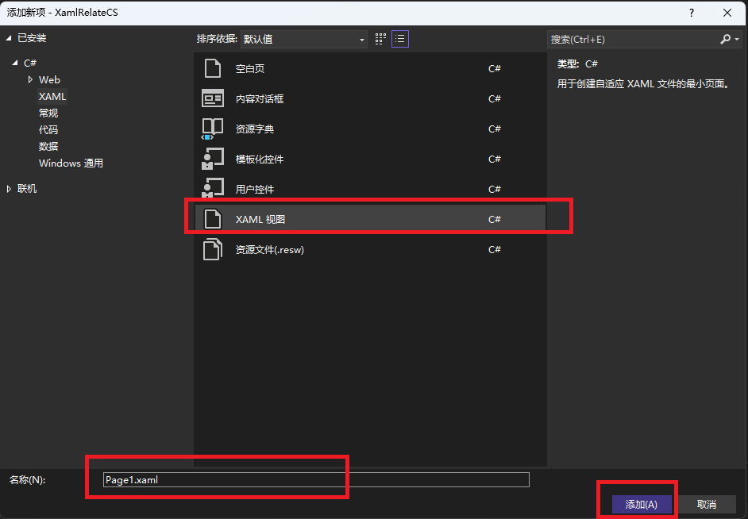
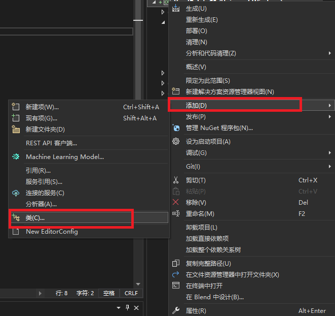
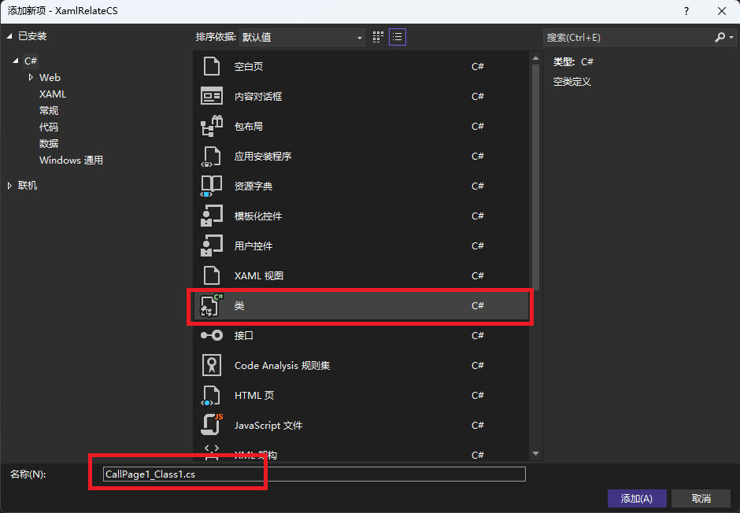
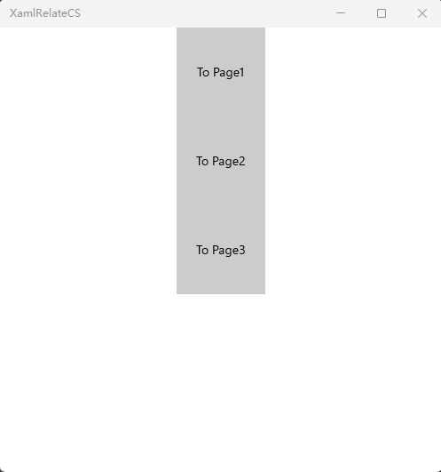

# UWP绘制一个表格  
图形界面：xaml  
开发语言：C#  
开发平台：Win11 22H2  
开发工具：Visual Studio 2022  
实现功能：研究XAML和CS的调用关系，单独新建一个XAML画一个Button，设置Button的点击事件是Button Clicked，然后新建一个类，调用此页面并实现此页面的Button的功能。  
涉及知识点：窗口的消息传递

## 实现功能  
第一步：添加新建项XAML视图  
  
第二步：添加类  
  
  
第三步：修改CallPage1_Class1.cs  
~~~C#
将
namespace XamlRelateCS
{
    internal class CallPage1_Class1
    {
    }
}
修改为：
namespace XamlRelateCS
{

    public sealed partial class Page1 : Page
    {
        public Page1()
        {
            this.InitializeComponent();
        }

        private void Button_Clicked(object sender, RoutedEventArgs e)
        {
            Page1Button.Content = "Page 1 is Clicked";
        }
    }
}
~~~  

## 效果演示  
  

